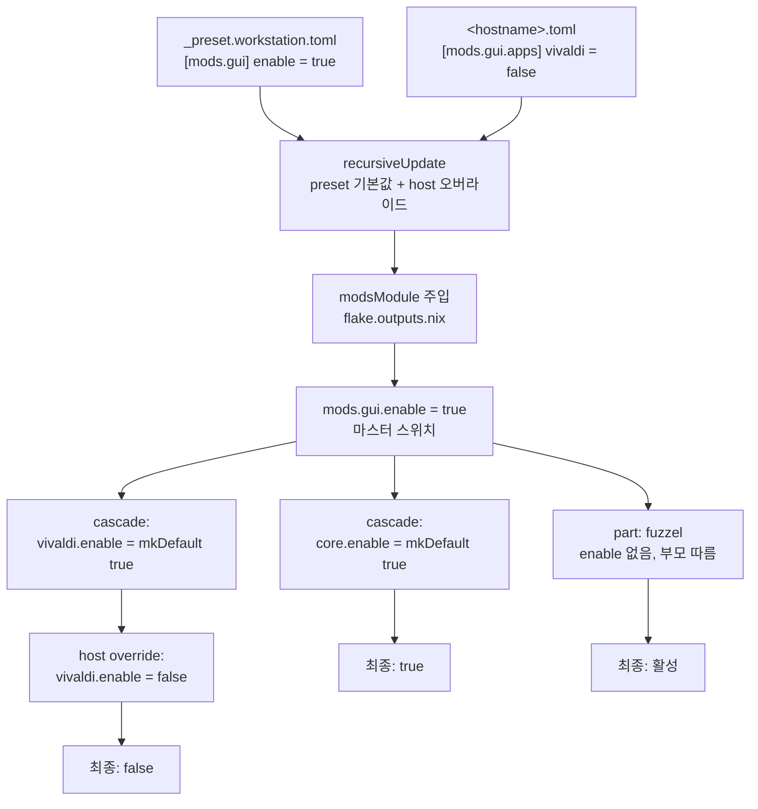

# 내부 원리

Mods 프레임워크의 구현 상세와 핵심 메커니즘을 설명합니다. 우측 목차로 원하는 섹션으로 바로 이동할 수 있습니다.

> 레이어 구조와 설계 결정 배경은 [아키텍처](./architecture.md) 참조  
> nixup / nixstrap의 단계별 실행 흐름은 [실행 라이프사이클](./lifecycle.md) 참조

---

## Mods 프레임워크 내부

```mermaid
--8<-- "_fragments/diagrams/mods-internals.mermaid"
```

> **사용법 및 API**: [Mod 만들기](../how-to/create-mod.md) · [Mod API](../reference/mod-api.md)

### 1. 모듈 자동 스캐닝 (`recursiveImportDir`)

**핵심 파일**: `core/lib/mods.nix`

`host.nix`가 `recursiveImportDir ../../mods`를 호출하면, `mods/` 하위의 모든 `.nix` 파일을 재귀적으로 탐색합니다. **동일한 모듈 집합이 NixOS와 Home Manager 양쪽에 로드됩니다** (host.nix에서 NixOS modules와 HM sharedModules에 각각 주입).

#### 제외 규칙

| 패턴 | 이유 |
|------|------|
| `_` prefix 디렉터리 | `_data/`(비-Nix 데이터) 등 모듈이 아닌 디렉터리 |
| `_` prefix 파일 | `_template.nix` 등 내부 유틸 |
| `*.home.nix` | 호스트별 조건부 로드 파일 — `host.nix`에서 별도 처리 |
| `*.overlay.nix` | 오버레이 전용 — `flake.outputs.nix`가 별도로 수집하여 `customOverlays`에 등록 |
| `default.nix` | Nix 모듈 시스템이 디렉터리 import 시 `default.nix`를 자동 로드하므로 중복 방지 |

#### 탐색 예시

```
mods/
├── sys/
│   ├── services/
│   │   ├── docker.nix       ← 로드됨
│   │   └── incus.nix        ← 로드됨
│   └── base/
│       ├── core.nix          ← 로드됨
│       └── zsh.nix           ← 로드됨
├── gui/
│   └── apps/
│       └── vivaldi.nix       ← 로드됨
├── _data/                     ← 전체 제외 (_ prefix)
│   └── zsh/init.zsh
└── _template.nix              ← 제외 (_ prefix)
```

---

### 2. 경로 자동 유도 (`pathFromPos`)

`mkMod __curPos "desc" bodyFn`에서 `__curPos`는 Nix 내장 변수로, 호출 시점의 파일 위치를 담고 있습니다.

#### 변환 과정

```
__curPos.file = "/home/user/nixos/mods/gui/apps/vivaldi.nix"
     ↓ modsRoot("/home/user/nixos/mods") 기준 상대 경로
"gui/apps/vivaldi.nix"
     ↓ .nix 제거
"gui/apps/vivaldi"
     ↓ / → . 치환 + "mods." prefix
"mods.gui.apps.vivaldi"
```

이 경로가 NixOS 옵션 트리에서 `options.mods.gui.apps.vivaldi.enable`로 선언됩니다.

#### `mkNamedMod`이 필요한 경우

`default.nix`에서는 `__curPos.file`이 `mods/gui/default.nix`가 되어 경로가 `mods.gui.default`로 잘못 변환됩니다. 이때 `mkNamedMod "mods.gui" "desc" bodyFn`으로 경로를 직접 지정합니다.

---

### 3. 헬퍼 패턴 — 왜 3가지인가

--8<-- "_fragments/mods/helper-table.md"

---

### 4. Enable 계층 구조

3단계 계층으로 구성됩니다.

#### 4-1. 마스터 스위치

```nix
# mods/gui.nix
{lib, config, ...}: {
  options.mods.gui.enable = lib.mkEnableOption "GUI Bundle";
  config = lib.mkIf config.mods.gui.enable {
    mods.sys.fonts.enable = true;   # 의존성 자동 활성화
    mods.sys.vfs.enable = true;
  };
}
```

`mods.gui.enable = true`가 되면 fonts, vfs 등 의존성도 함께 켜집니다.

#### 4-2. mkModOf 연쇄 활성화

```nix
# mods/gui/apps/vivaldi.nix
mkModOf "mods.gui" __curPos "Vivaldi Browser" ({...}: {hm = {...};})
```

내부적으로 `cascadeModule`이 추가되어:

```nix
config = lib.mkIf config.mods.gui.enable
  (lib.setAttrByPath ["mods" "gui" "apps" "vivaldi"] {enable = lib.mkDefault true;});
```

`mkDefault`이므로 host.toml에서 `vivaldi = false`로 오버라이드 가능합니다.

#### 4-3. mkPartOf 종속

```nix
# mods/gui/base/fuzzel.nix
mkPartOf "mods.gui" ({...}: {hm = {...};})
```

자체 enable 없이 `config.mods.gui.enable`에 직접 종속. `lib.mkIf cfg.enable`가 자동 적용됩니다.

#### 전체 흐름



---

### 5. autoWrap — 자동 조건부 적용

`mkMod`/`mkModOf`의 `bodyFn`이 반환하는 `os`/`hm` 블록에 대해:

| 블록 형태 | 처리 |
|-----------|------|
| Plain attrset (`{services.foo = true;}`) | `lib.mkIf cfg.enable` 자동 wrapping |
| `_type` 있음 (`lib.mkMerge [...]`, `lib.mkIf ...`) | **그대로 통과** — 이미 직접 조합한 것 |

이 덕분에 모듈 작성자가 매번 `lib.mkIf cfg.enable`을 직접 쓸 필요가 없습니다.

---

### 6. Dual-Context (`forOS` 분기)

#### 주입 지점

`host.nix`에서:

| 컨텍스트 | 주입 값 | 적용 블록 |
|----------|---------|-----------|
| NixOS system modules | `forOS = true` | `body.os` |
| HM sharedModules | `forOS = false` | `body.hm` |
| homeConfigurations (standalone) | `forOS = false` | `body.hm` |

#### 분기 메커니즘

`mkNamedMod` 내부:

```nix
config =
  if forOS
  then autoWrap (body.os or {})    # NixOS 평가 시
  else autoWrap (body.hm or {});   # HM 평가 시
```

**모듈 파일 하나에 `os`와 `hm`을 함께 선언**하면, 각 컨텍스트에서 해당 블록만 자동으로 선택됩니다. `os`만 있는 모듈은 HM 평가 시 빈 config를 반환하고, `hm`만 있는 모듈은 NixOS 평가 시 빈 config를 반환합니다.

---

## 핵심 메커니즘

### 빌드 격리 (Build Isolation)

사용자의 작업 환경을 보호하고, `flake.lock`을 메인 레포 밖에서 관리합니다.

- **문제**: `flake.lock`을 메인 레포에 커밋하면 rolling/stable 브랜치가 서로 다른 락을 요구해 충돌이 발생합니다. 또한 nix는 기본적으로 git 기반 평가를 시도하므로 별도의 처리가 필요합니다.
- **해결**: 빌드 전 소스를 `.build/`에 물리 복사하고 nix를 **`path:` 모드**로 호출합니다.
  - `.build/`는 메인 레포의 `.gitignore`에 등록되어 있고 자체 `.git`이 없습니다. `path:` prefix를 붙이면 nix가 git 추적 여부를 확인하지 않고 파일시스템 그대로 store에 복사해 평가합니다.
  - `flake.lock`은 `.build/` 안에만 존재하고 메인 레포에 커밋되지 않습니다. rolling 기기는 매 빌드마다 갱신되고, stable 기기는 `.locks/<hostname>.lock`에서 복사됩니다.
  - 커밋하지 않은 실험적인 코드를 메인 리포지토리 기록 손상 없이 즉시 테스트할 수 있습니다.

---

### 하이브리드 잠금 전략 (Hybrid Lock Strategy)

하나의 리포지토리로 최신 성능과 안정성을 동시에 추구합니다.

- **Rolling 기기**: 항상 최신 패키지를 테스트하는 기기들(`isRolling=true`)은 공용 **`_rolling.lock`**을 사용하여 활발한 업데이트를 유도합니다.
- **Stable 기기**: 서버나 안정적인 작업용 기기들은 개별 **`<hostname>.lock`**으로 고정된 패키지 버전을 유지합니다.
- **전환**: 기기의 기동 시점에 엔진이 어떤 잠금 파일을 사용할지 지능적으로 결정합니다.

---

### 지능형 패키지 복구 (Fallback System)

Unstable 채널 사용자의 최대 고민인 '빌드 실패'를 자동화로 해결합니다.

- **메커니즘 (`fix-unstable`)**:
  1. 깨진 패키지의 히스토리를 GitHub API로 추적합니다.
  2. 가장 최근에 빌드가 성공했던 시점의 커밋 해시를 찾아냅니다.
  3. 해당 해시와 SHA256을 프로젝트 루트 **`.env`**에 기록합니다.
- **`.env` 파일 형식** (git 추적 제외):
  ```bash
  NIXUP_LAST_HOST=<마지막으로 빌드한 호스트명>
  NIX_UNSTABLE_FALLBACK_REV=<nixpkgs 커밋 해시>    # nixup fix가 관리
  NIX_UNSTABLE_FALLBACK_SHA=<sha256 해시>          # nixup fix가 관리
  ```
- **적용**: `flake.nix`의 빌더가 `.env`를 감지하여 `unstable-fallback` 패키지 세트를 해당 커밋 기준으로 구성합니다. 전체 시스템은 최신 상태로 유지하면서 **문제 있는 특정 패키지만 안전한 구버전**으로 내려서 빌드합니다.

---

### Mods Coverage Check

새 옵션이 추가될 때 프리셋 선언에서 누락되는 것을 빌드 타임에 감지합니다.

- **문제**: `workspace-options.nix`에 새 `enable` 옵션을 추가하면서 프리셋 TOML에 해당 항목을 기재하지 않으면, 신규 기능이 의도치 않게 모든 호스트에서 비활성화 상태로 방치됩니다.
- **해결**: `core/lib/preset.nix`가 호스트별로 주입되어 두 목록을 대조합니다. 일반 호스트뿐 아니라 ISO 빌드(`custom-iso`, `custom-iso-aarch64`)도 coverageModule 대상에 포함됩니다.
  1. **presetCovered**: `presets.json`에서 읽은 preset mods의 `.enable` 경로 목록
  2. **declaredOptions**: `options.mods`를 재귀 탐색하여 찾은 선언된 `.enable` 옵션 목록
- **두 가지 검사** — 하나라도 실패하면 빌드 타임 오류:
  1. **누락 검사**: `declaredOptions`에 있지만 `presetCovered`에 없는 옵션이 존재하면 오류
  2. **형제 완전성 검사**: 같은 그룹(공통 부모, 예: `mods.gui.apps`) 내 옵션 중 하나라도 preset에 명시했다면 같은 그룹의 나머지 옵션도 전부 명시해야 합니다
- 의도적으로 프리셋 외부에서 관리되는 옵션은 프리셋 TOML의 `[explicitOptional]`에 등록하면 체크에서 제외됩니다.

---

### 오버레이 시스템 (Overlay System)

복잡한 패키지 의존성 문제를 선언적으로 해결합니다.

- **`mkWrapper` (`core/overlays/wrapper.nix`)**: 패키지의 소스 코드를 수정하지 않고도, 실행 파일에 필요한 환경 변수(`PATH`, `LD_LIBRARY_PATH` 등)를 주입하거나 래핑(Wrapping)할 수 있는 범용 헬퍼 함수입니다. `pkg`, `binName`을 기본으로 받으며 `libs`(LD_LIBRARY_PATH), `bins`(PATH), `env`(환경변수), `run`(실행 전 쉘 훅), `addFlags`(인수 추가)를 선택적으로 조합할 수 있습니다.
- **`*.overlay.nix` 자동 탐색**: `mods/` 하위 어디든 `<name>.overlay.nix` 파일을 두면 `flake.outputs.nix`가 자동 탐색하여 `customOverlays`에 추가합니다.

**현재 등록된 overlay 목록** (`mods/devel/toolchains/`):

| 파일 | 노출 attrset | 역할 |
|------|-------------|------|
| `jetbrains.overlay.nix` | `pkgs.jetbrains-wrapped.*` | UI 스케일 고정, XWayland 커서 크기 고정, 프로젝트 디렉터리 자동 생성 |
| `node.overlay.nix` | `pkgs.node-wrapped`, `pkgs.pnpm-wrapped` | OpenSSL 라이브러리 주입, Prisma 엔진 자동 탐색, yarn → pnpm 호환 래퍼 |
| `fvm.overlay.nix` | `pkgs.fvm-wrapped` | Flutter 런타임 동적 링킹 라이브러리 전체 주입 |
