**nixstrap**: 새 로컬 기기에 NixOS를 처음 설치할 때 사용합니다. 커스텀 ISO 부팅 또는 기존 환경에서 `./nixstrap.sh`로 진입합니다.

**rnixstrap**: 원격 서버에 nixos-anywhere로 초기 설치하는 도구입니다. `rnixstrap` 명령으로 진입합니다. Phase 1 입력 수집 후 `run_setup`에서 TOML 생성 → nixos-anywhere 설치 → deploy-rs 배포 순으로 진행합니다.

```mermaid
flowchart TD
    Entry(["`**nixstrap** 진입
    (커스텀 ISO 또는 ./nixstrap.sh)`"]) --> LoadParams

    LoadParams{이전 세션 파라미터 존재?}
    LoadParams -->|"Yes → 불러와 검토"| Review
    LoadParams -->|"No"| RepoCheck

    subgraph P1["Phase 1  ·  입력 수집"]

        subgraph P1A["레포 · 호스트"]
            RepoCheck{NIXOS_REPO_PATH 설정됨?}
            RepoCheck -->|"Yes (./nixstrap.sh)"| SetLocalRepo["현재 레포 경로를
            REPO_TMP로 사용"]
            RepoCheck -->|"No (커스텀 ISO)"| Clone["ask_repo_and_clone
            GitHub 클론"]
            SetLocalRepo & Clone --> SelectHost["select_host
            기존 호스트 선택 or 새 이름 입력"]
            SelectHost -->|"신규 호스트"| AskPreset["ask_preset
            workstation / server"]
            AskPreset --> AskSV["ask_state_version
            릴리즈 고정 or rolling"]
        end

        subgraph P1B["파티셔닝"]
            AskParts{"ask_partitions
            모드 선택"}
            AskParts -->|"mode 1"| M1["기존 EFI · root 파티션
            직접 지정"]
            AskParts -->|"mode 2"| M2["디스크 · 범위 선택
            → 자동 생성"]
        end

        subgraph P1C["검토 · 저장"]
            Review["review_loop
            설정 확인 → params 저장"]
            AskPw["ask_password
            비밀번호 입력 (메모리에만 보관)"]
            Review --> AskPw
        end

    end

    SelectHost -->|"기존 호스트"| AskParts
    AskSV --> AskParts
    M1 & M2 --> Review
    AskPw --> S1

    subgraph P2["Phase 2  ·  설치 실행"]

        subgraph P2A["디스크 준비"]
            S1["cleanup_mounts
            이전 마운트 해제"]
            S2["read_disk_labels
            TOML → BOOT_LABEL / DISK_LABEL"]
            S3["create_partitions
            (mode 2: GPT · ESP · root 파티션 생성)"]
            S4["format_boot / format_root
            fat32 · Btrfs + 서브볼륨 @·@home·@nix·@log"]
            S5["mount_partitions
            /mnt 마운트 (btrfs 옵션 적용)"]
            S1 --> S2 --> S3 --> S4 --> S5
        end

        subgraph P2B["설치 환경 구성"]
            S6["move_repo
            REPO_TMP → /mnt/etc/nixos"]
            S7["create_host_profile
            신규 호스트: <hostname>.toml · .nix 생성"]
            S8["resolve_metadata
            nixup.task-resolve.py → resolved.json / presets.json"]
            S9["extract_username
            _base.toml → USERNAME"]
            S10["prepare_build_dir
            /tmp/nixos-build 격리 환경 구성"]
            S11["generate_hw_config
            nixos-generate-config → hardware.nix (BUILD_DIR)"]
            S6 --> S7 --> S8 --> S9 --> S10 --> S11
        end

        subgraph P2C["설치 · 후처리"]
            S12["nixos-install
            --no-root-passwd --flake path:#HOST"]
            S13["_post_process
            mv nixos → /home/USERNAME
            chown · symlink /etc/nixos
            chpasswd → 메모리 즉시 비움"]
            S12 --> S13
        end

    end

    S5 --> S6
    S11 --> S12
    S13 --> Done(["✓ 설치 완료 → 재부팅"])

```

---

## 사전 초기화 · sync-remote

`./nixstrap.sh` 또는 `./nixup-iso.sh` 실행 직후, Phase 1 입력 수집에 앞서 `nixstrap.lib-repo.py sync-remote`가 자동으로 실행됩니다.

| 단계 | 동작 |
|------|------|
| 1 | `git remote get-url origin`으로 `owner/repo` 자동 감지 |
| 2 | `_base.toml`의 `git.nixosRepo`와 불일치 시 자동 갱신 |
| 3 | GitHub API로 `git.name` / `git.email` 자동 채우기 (API 실패 시 대화형 입력) |
| 4 | `username` 대화형 입력 |

> remote가 없거나 `_base.toml`이 이미 일치하는 경우 자동으로 건너뜁니다.

---

## Phase 1 · 입력 수집

이전 세션의 파라미터 파일이 존재하면 불러와 검토 단계(review_loop)로 바로 진입합니다. 없으면 아래 순서로 입력을 수집합니다.

### 레포 · 호스트

1. **레포 준비**: `NIXOS_REPO_PATH`가 설정된 경우(`./nixstrap.sh` 실행) 현재 레포 경로를 그대로 사용합니다. 커스텀 ISO 환경에서는 `ask_repo_and_clone`으로 GitHub에서 클론합니다.
2. **호스트 선택**: `select_host`로 기존 호스트를 선택하거나 새 이름을 입력합니다. 신규 호스트라면 `ask_preset`으로 `workstation` / `server` 중 프리셋을 지정하고, `ask_host_username`으로 호스트별 username을 입력합니다(`_base.toml` 기본값 표시, 변경 없으면 Enter).
3. **릴리즈 고정**: `ask_state_version`으로 NixOS 릴리즈를 고정하거나 rolling으로 유지합니다. 신규 호스트에만 해당합니다.

### 파티셔닝

`ask_partitions`에서 두 가지 모드를 선택합니다.

- **mode 1**: 이미 존재하는 EFI · root 파티션을 직접 지정합니다.
- **mode 2**: 대상 디스크와 파티션 범위를 선택하면 nixstrap이 자동으로 생성합니다.

### 검토 · 저장

- **검토**: `review_loop`에서 수집된 설정을 확인하고 params 파일에 저장합니다. 항목 번호를 입력해 개별 수정할 수 있습니다.
- **비밀번호**: `ask_password`에서 첫 로그인용 비밀번호를 입력합니다. 파일에 저장하지 않고 메모리에만 보관하며, 설치 완료 후 즉시 비웁니다.

---

## Phase 2 · 설치 실행

총 14단계로 구성됩니다.

### 디스크 준비 (1–5)

| # | 함수 | 설명 |
|---|------|------|
| 1 | `cleanup_mounts` | 이전 마운트 잔재 해제 |
| 2 | `read_disk_labels` | TOML → `BOOT_LABEL` / `DISK_LABEL` 결정 |
| 3 | `create_partitions` | mode 2 전용: GPT · ESP · root 파티션 생성 |
| 4 | `format_boot / format_root` | ESP → FAT32 · root → Btrfs 포맷 + 서브볼륨(`@`, `@home`, `@nix`, `@log`) 생성 |
| 5 | `mount_partitions` | `/mnt` 마운트 (btrfs 옵션 적용) |

### 설치 환경 구성 (6–11)

| # | 함수 | 설명 |
|---|------|------|
| 6 | `move_repo` | `REPO_TMP` → `/mnt/etc/nixos` 이동 |
| 7 | `create_host_profile` | 신규 호스트: `<hostname>.toml` · `<hostname>.nix` 생성 |
| 8 | `resolve_metadata` | `nixup.task-resolve.py` 실행 → `resolved.json` / `presets.json` |
| 9 | `extract_username` | `_base.toml` → `USERNAME` 결정 |
| 10 | `prepare_build_dir` | `/tmp/nixos-build` 격리 환경 구성 |
| 11 | `generate_hw_config` | `nixos-generate-config --show-hardware-config` → `hardware.nix` (BUILD_DIR에만 생성) |

### 설치 · 후처리 (12–14)

| # | 함수 | 설명 |
|---|------|------|
| 12 | `nixos-install` | `--no-root-passwd --flake path:#HOST` 로 설치 |
| 13–14 | `_post_process` | `/mnt/etc/nixos` → `/home/USERNAME/nixos` 이동, chown · symlink, `chpasswd`로 비밀번호 자동 적용 후 메모리 즉시 비움 |

> **타이머**: Phase 1 전체(입력 수집 · review_loop · ask_password)가 완료된 직후, phase2_execute 시작 전부터 실행 시간을 측정합니다. 사용자가 대화에 머무른 시간은 제외됩니다.

---

## rnixstrap 흐름

원격 서버 초기 설치 전용입니다. `nixstrap`과 달리 디스크 파티셔닝을 직접 수행하지 않고 nixos-anywhere에 위임합니다.

### Phase 1 · 입력 수집

| 입력 | 설명 |
|------|------|
| 호스트 선택/신규 | 기존 TOML에서 선택하거나 새 hostname 입력 |
| IP 주소 | 접속 대상 서버 IP |
| SSH 키 경로 | `~/.ssh/rnixup/` 하위 권장. TOML 저장 시 `~` 정규화 |
| system | `x86_64-linux` / `aarch64-linux` (신규 호스트만) |
| 서비스 | headscale 등 선택적 활성화 (신규 호스트만) |

### run_setup · 설정 확인 및 실행

1. **_probe_ram**: SSH로 서버 RAM 사전 측정 (kexec 최소 1000MB 확인)
2. **설정 확인 · 선택**: `_pick`으로 바로 진행 / 쓰기만 / 취소 선택 — **타이머는 선택 직후부터 시작**
3. **파일 작업**: `hosts/<hostname>.toml` · `hosts/<hostname>.nix` 생성 또는 업데이트
4. **SSH 정보 추출**: 서버에서 공개키 추출 → `hosts/deploy/<hostname>.pub` 저장
5. **nixos-anywhere**: 서버에 원격 파티셔닝 + NixOS 설치
   - 생성된 `hardware.nix`를 `hosts/deploy/<hostname>.hardware.nix`로 레포에 역복사
6. **deploy-rs 배포**: 설치 완료 후 rnixup으로 초기 설정 배포
